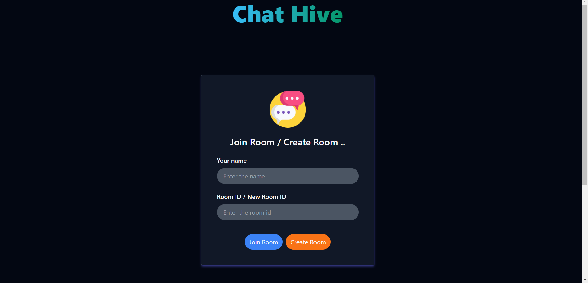
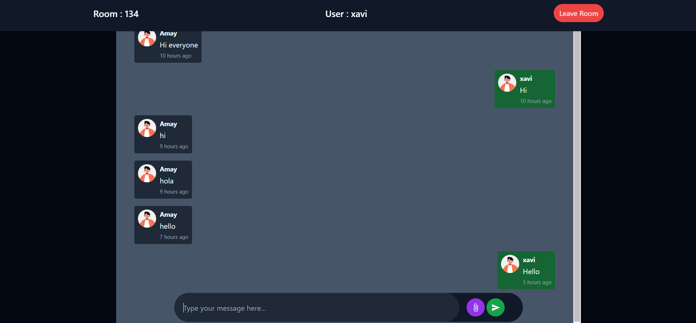

# ChatHive - Real-Time Chat Application




Welcome to **ChatHive**, a real-time chat application backend designed to handle multiple users and chat rooms efficiently an frontend designed for bettter user interactions. ChatHive provides the core infrastructure for real-time communication with secure user management, message persistence, and scalable architecture.

## Table of Contents

- [Overview](#overview)
- [Features](#features)
- [Demo](#demo)
- [Tech Stack](#tech-stack)
- [Installation](#installation)
- [Usage](#usage)
- [API Endpoints](#api-endpoints)
- [Contributing](#contributing)

## Overview

**ChatHive** is a scalable and real-time chat application backend built with Spring Boot and MongoDB and Frontend built with ReactJs, ViteJs and Tailwind CSS. It offers WebSocket-based communication for real-time message delivery and supports secure user authentication and message persistence. Whether you're building a social platform, a chat app, or integrating live messaging into your service, ChatHive provides all the essentials to get you started.

## Features

- **Real-Time Messaging**: Enables real-time chat between users in multiple chat rooms.
- **User Authentication**: Secure registration and login with password encryption.
- **Chat Room Management**: Create, join, and leave chat rooms.
- **Message Persistence**: Stores messages in MongoDB for easy retrieval and future reference.
- **Scalable Design**: Built to handle multiple users and chat rooms with efficient data storage.
- **WebSocket Integration**: Supports WebSocket for fast, real-time messaging.

## Demo

You can try out ChatHive live [here](https://chat-hivee.netlify.app/).

## Tech Stack

- Java 17
- Spring Boot
- Spring Security
- Spring Data MongoDB
- Spring WebSocket
- MongoDB
- Docker
- Maven
- React.js
- Vite.js
- Tailwind Css

## Installation

Follow these steps to set up **EchoMind** locally:

1. Clone the repository:
    ```bash
    git clone https://github.com/omgupta7352/ChatHive.git
    cd /ChatHive
    ```

2. Set up the backend:
    - Install required dependencies:
        ```bash
        cd /ChatHive
        mvn install
        ```
    - Configure your AI API in `application.properties`.

    - Run the backend server:
        ```bash
        mvn spring-boot:run
        ```

3. Set up the frontend:
    - Navigate to the frontend directory:
        ```bash
        cd chathive-frontend
        npm install
        ```
    - Run the React development server:
        ```bash
        npm run dev
        ```

4. The app will be available at `http://localhost:5173`.

## Usage

Once the app is set up, you can use the following API endpoints and WebSocket for real-time communication.

### Example Workflow:

- Create a user, log in, and create a chat room.
- Start chatting by sending and receiving messages in real-time via WebSocket.

## API Endpoints

### Authentication
- `POST /auth/register`: Register a new user.
- `POST /auth/login`: Log in and receive a JWT token.

### Chat Room Management
- `POST /rooms`: Create a new chat room.
- `GET /rooms`: List all chat rooms.
- `POST /rooms/{roomId}/join`: Join a chat room.
- `POST /rooms/{roomId}/leave`: Leave a chat room.

### Messaging
- `POST /rooms/{roomId}/messages`: Send a message to a chat room.
- `GET /rooms/{roomId}/messages`: Retrieve all messages from a chat room.

### WebSocket
The WebSocket endpoint for real-time messaging is:

